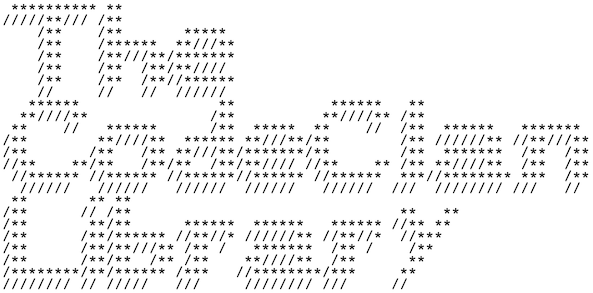
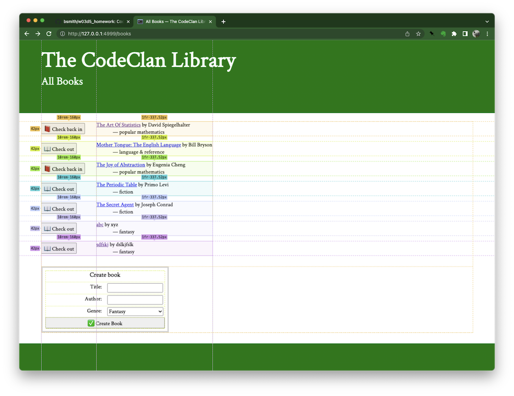
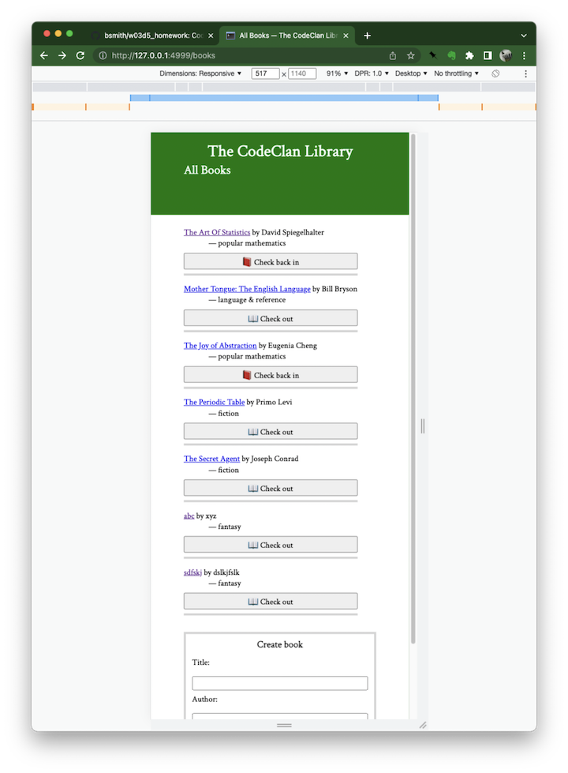
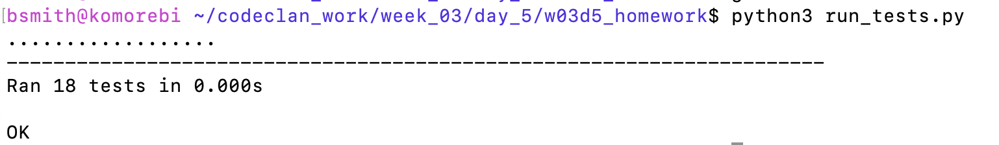
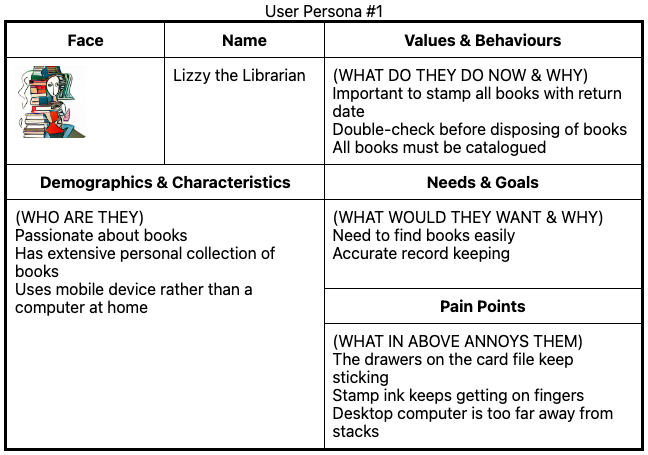

Welcome to The CodeClan Library.  This is a simple application that can 
handle a set of books in a library, and record their check-in status.

Books in the library can be listed with different sort options.  Books can
have their details inspected.  Books can be added and deleted.  Books can
be checked in and out of the library.

The app is styled using modern responsive CSS3 such as grid, flex and webfonts.
It includes media queries to enable a 'mobile phone friendly' view with large
touch targets.

The application was developed using Test Driven Development for the models.

The features and UX was guided by an example user Persona.

The white-on-green hero colour scheme has a WCAG contrast ratio of
[5.77](https://contrast-ratio.com/#rgb%280%2C%20119%2C%200%29-on-white).

----

[Design notes](DESIGN.md) and todo list.
